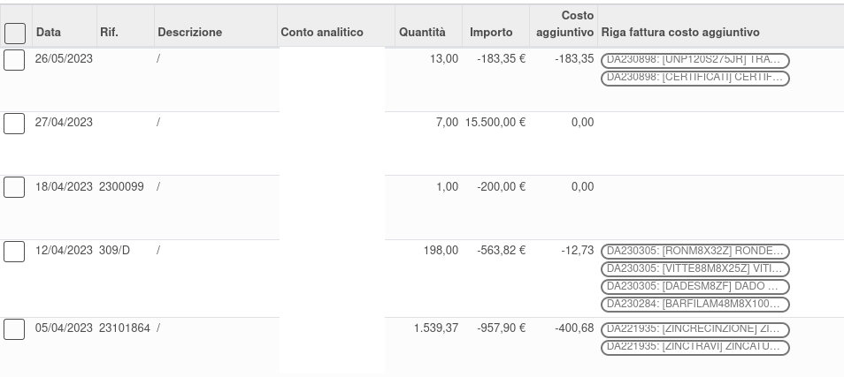

Questo modulo calcola il costo aggiuntivo sostenuto da fatture o note di credito fornitori per prodotto detraendo la parte già sostenuta nelle righe di consumo dei componenti. Nel caso in cui in fattura ci siano prodotti non presenti nei movimenti di scarico della produzione, verranno imputati interamente.

Questo approccio è chiaramente limitato all'esattezza dei prodotti consumati nella produzione: se fosse stato consumato il prodotto alternativo al prodotto presente in fattura, il costo verrebbe imputato doppiamente.

Il modulo quindi prende le righe delle fatture/note di credito acquisti e le righe di movimenti di magazzino dei componenti della produzione, tutte raggruppate per prodotto, e restituisce solo l'eventuale differenza positiva.

Nella maschera delle righe analitiche sono stati aggiunti un campo con il totale costo aggiuntivo calcolato e le righe fatture/note di credito fornitori relative:

