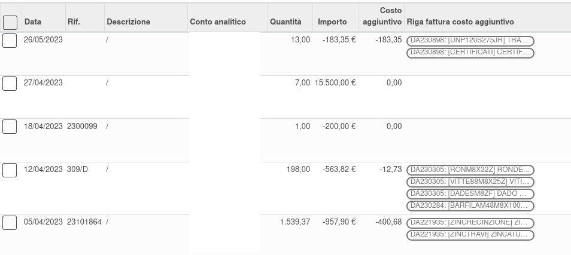

Questo modulo calcola il costo effettivo sostenuto da fatture o note di credito fornitori per prodotto in relazione al consumo dei componenti di una produzione.

Nel caso in cui in fattura ci siano prodotti non presenti nei movimenti di scarico della produzione oppure ci siano servizi, vanno imputati interamente attraverso il sistema di reportistica in uso.

Il modulo quindi estrae per ogni riga delle fatture/note di credito acquisti con il conto analitico della produzione e lo stesso prodotto, il costo d'acquisto unitario. La media pesata del costo d'aquisto delle righe analitiche con lo stesso prodotto verrà moltiplicata per la somma delle quantità consumate nelle produzioni collegate a quel conto analitico.

Nella maschera delle righe analitiche è possibile vedere il totale costo aggiuntivo calcolato e le righe fatture/note di credito fornitori relative:

