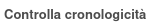
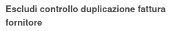

To configure this module, go to the menu *Accounting/Invoicing > Configuration > Accounting > Journals* and activate the option *Check Chronology* on the relevant journals. After the installation of the module, this option will be active on *sale* and *purchase* journals.

To exclude some invoices from check, you can check *Bypass Duplicate Vendor Ref*:

