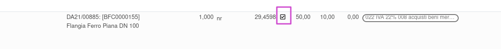

Questo modulo aggiunge un bottone sulle righe fattura, visibile solo a chi ha il permesso "Allow "Purchase update from invoice"" e quando il prezzo o uno degli sconti è diverso da quello della riga ordine d'acquisto collegata.

Cliccando il bottone, viene aggiornata la riga ordine di acquisto, e di conseguenza il costo del movimento di magazzino e il costo del prodotto, se è in una categoria configurata con il "Metodo determinazione costo" diverso da costo standard.

