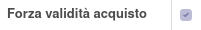

Questo modulo aggiunge un bottone sulle righe fattura, visibile solo a chi ha il permesso "Allow "Purchase update from invoice"" e quando il prezzo o uno degli sconti è diverso da quello della riga ordine d'acquisto collegata.

Cliccando il bottone, vengono aggiornati:

#. la riga d'ordine di acquisto
#. il listino prezzi di acquisto del fornitore del prodotto
#. il costo del movimento di magazzino¹
#. se il "Metodo determinazione costo" della categoria del prodotto è "Costo Medio": il costo del prodotto²

.. image:: ../static/description/bottone.png
    :alt: Bottone

È possibile forzare la validità di una fattura rispetto all'ordine di acquisto tramite il flag `Forza validità acquisto`:

¹tramite il modulo incluso nelle dipendenze: purchase_stock_price_unit_sync
²se è installato il modulo: product_cost_price_avco_sync
