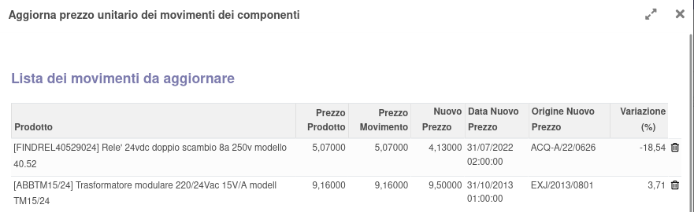
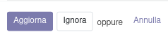
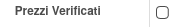

Questo modulo aggiunge una procedura guidata per verificare la congruità dei prezzi dei movimenti di scarico con i prezzi di acquisto, al fine di calcolare correttamente i costi di produzione.

Viene mostrato come prezzo nuovo quello trovato secondo il seguente ordine di priorità decrescente:

#. c'è un trasferimento (in data inferiore o uguale allo scarico) (in stato completato o pronto) generato da un acquisto: se fatturato (in stato non bozza né annullato): prezzo in fattura, se non fatturato: prezzo in ordine
#. altrimenti se c'è una fattura di acquisto (in data inferiore o uguale allo scarico) (in stato non bozza né annullato): prezzo in fattura
#. infine se c'è un ordine di acquisto (in data inferiore o uguale allo scarico) (in stato ordine o completato): prezzo in ordine (nel caso il trasferimento non sia completato o pronto quindi)

La procedura si apre cliccando sul bottone, visibile solo se la produzione è completata:

e mostra i seguenti campi:

È possibile confermare l'aggiornamento di prezzi, rimuovendo le righe che non si vogliono aggiornare, con il bottone 'Aggiorna', oppure marcare la produzione come verificata con il bottone 'Ignora', oppure uscire dalla procedura con il bottona 'Annulla':

Nel tab 'Varie' è possibile rendere nuovamente disponibile il bottone togliendo il flag 'Prezzi Verificati':

NOTE: questa procedura non tiene conto delle quantità disponibili a magazzino del prodotto, per cui ad es. anche l'acquisto di 1 singolo pezzo ad un prezzo diverso viene segnalato come prezzo diverso dal precedente.
