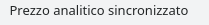
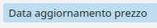
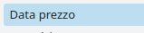

Questo modulo aggiorna il prezzo `price_unit` dei movimenti di magazzino di scarico del prodotto (da vendita o produzione) con un conto analitico, in modo da averlo sempre corretto per data. Lo fa a partire da:

#. validazione fattura d'acquisto
#. validazione movimento di scarico

Il prezzo viene calcolato su una media ponderata sulle quantità fatturate in tutte le righe fattura d'acquisto con quel prodotto e quel conto analitico, senza un controllo delle quantità (quindi qualsiasi quantità in acquisto viene utilizzata per calcolare il prezzo medio da imputare al prezzo unitario dei trasferimenti).

Es. acquisto 18 pz a 188€ ognuno e 10 pz a 265€ ognuno, per un totale di 28 pz e 6.034,00€, ad un prezzo medio di 215,50€.
Verrà quindi imputato un prezzo unitario di 215,50€ ai trasferimenti di scarico da produzione e da vendite.

La funzione aggiorna inoltre tutti i movimenti di scarico/consumo con un conto analitico, successivi all'ingresso del materiale per i quali non sia stato fatto l'aggiornamento con il prezzo medio sopra (es. un acquisto fatto precedentemente con un altro conto analitico o senza, in quanto una parte può essere rimasta a magazzino), con l'ultimo prezzo presente prima dello scarico (ad es. nel caso sopra uno scarico successivo al secondo acquisto, verrà valorizzato a 265€/cad, indifferentemente dalla quantità). Questa parte della funzione quindi prende i prezzi da una qualsiasi fattura d'acquisto sia con che senza conto analitico, per rilevare solo il prezzo precedente più vicino a quello di consumo dell'articolo.

Viene scritta sul movimento di magazzino la data dell'aggiornamento del prezzo, che è la data in cui il metodo ha eseguito l'azione, e la data del prezzo rilevato se non è un prezzo medio.

Sono stati inoltre aggiunti dei campi per fare delle verifiche:

#. il campo "Ha un conto analitico da produzione o vendita" filtrabile per trovare i movimenti di magazzino con il conto analitico nella produzione o vendita collegata -> serve per filtrare gli scarichi in modo da vedere quali sono senza conto analitico:

#. il campo "Prezzo analitico sincronizzato" che è vero quando il prezzo è stato aggiornato:

#. il campo "Data aggiornamento prezzo" che contiene la data in cui la funzione ha aggiornato il prezzo:

#. il campo "Prezzo sincronizzato" che è vero quando è stato aggiornato uno dei due campi sopra:

#. il campo "Data prezzo" che contiene la data del documento da cui è stato preso il prezzo

