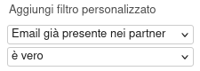
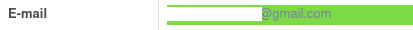

Questo modulo aggiunge al lead del CRM un campo per filtrare quelli che sono senza partner ma la cui mail è già presente in un partner registrato.

Questo è il campo da usare per fare il filtro:

Nel lead la mail viene evidenziata nel caso sia presente nell'anagrafica dei partner ma questo non sia collegato a questo lead:

