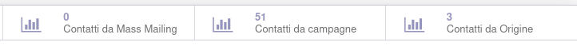

Questo modulo aggiunge al tracciamento link la lista dei contatti creati, rilevati in maniera probabilistica.

Se il contatto è stato creato successivamente alla creazione del tracciamento (è stata inviata una mail da mass mailing, oppure il partner è collegato alla campagna o alla fonte) viene mostrato nel tracciamento:

