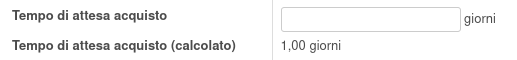

Con questo modulo è possibile configurare un tempo di attesa acquisto
per calcoli di previsione in altri moduli. Se non viene impostato un
valore, verrà calcolato in automatico dal tempo di attesa del primo
fornitore nel tab acquisti.

