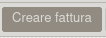
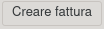
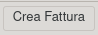
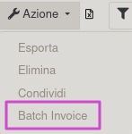

Nell'ordine di acquisto sono nascosti i buttoni 'Creare fattura' di default, che creano fatture anche se non c'è nulla da fatturare e con righe a zero:

È quindi solo visibile il bottone 'Crea fattura' quando ci sono righe da fatturare:

e l'azione 'Batch Invoice' nella vista ad elenco dopo aver selezionato almeno un ordine di acquisto:

