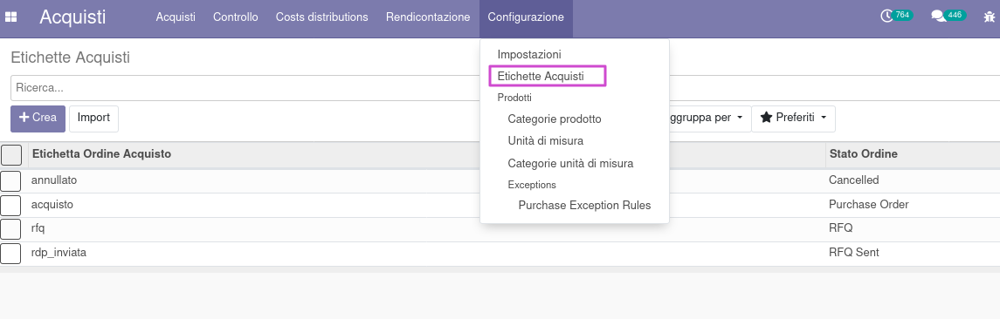

Nell'ordine di acquisto viene aggiunto un campo in cui selezionare delle etichette, filtrate per lo stato dell'ordine. Una volta creata, si può impostare il colore dell'etichetta.

N.B.: È possibile impostare una sola etichetta per stato, il cui colore sarà usato nelle viste ad elenco in cui sono visualizzati gli ordini di acquisto, per aver chiaro lo stato dell'ordine.

Nella configurazione degli acquisti è disponibile una vista ad elenco delle etichette:

