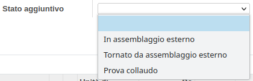

Nell'ordine di vendita è stato aggiunto un campo calcolato che mostra lo
stato della lavorazione dell'ordine in merito alla sua consegnabilità,
denominato \`Stato di calendario\`:

Nell'ordine di produzione è possibile impostare uno stato aggiuntivo (in
successivo sviluppo verrà calcolato in automatico):

tramite i vari bottoni:

Lo stato di calendario, visto che possono esserci diverse situazioni che
si avverano allo stesso tempo (es. la produzione è avviata ma mancano
dei componenti, prevale la mancanza di componenti) viene assegnato in
base alla seguente priorità in ordine decrescente:

1.  BLOCKED
2.  TOPROCESS
3.  PRODUCTION_NOT_EVALUATED
4.  TO_ASSEMBLY
5.  TO_SUBMANUFACTURE
6.  TO_TEST
7.  MISSING_COMPONENTS_PRODUCE
8.  PRODUCTION_PLANNED
9.  PRODUCTION_READY
10. PRODUCTION_STARTED
11. DONE
12. NOT_EVALUATED
13. MISSING_COMPONENTS_BUY
14. PARTIALLYDELIVERED
15. AVAILABLEREADY
16. WAITING_FOR_PACKING
17. DELIVERY_READY
18. DONE_DELIVERY
19. INVOICED
20. SHIPPED

Gli stati di calendario relativi alla produzione hanno una priorità più
alta rispetto a quelli relativi ai trasferimenti, in quanto la
produzione precede il trasferimento dei beni prodotti.

La logica di assegnazione dello stato dà inoltre la priorità alla
mancanza di materiali, in seguito se l'OUT è Stampato per logistica,
mentre il fatto che tutti i prodotti siano riservati non influisce.

L'opzione Stampato logistica è comandato da questi due bottoni:

