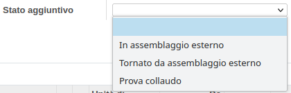

Nell'ordine di vendita è stato aggiunto un campo calcolato che mostra lo stato della lavorazione dell'ordine in merito alla sua consegnabilità, denominato `Stato di calendario`:

Nell'ordine di produzione è possibile impostare uno stato aggiuntivo (in successivo sviluppo verrà calcolato in automatico):

tramite i vari bottoni:

.. image:: ../static/description/cancella_stato_aggiuntivo.png
    :alt: Cancella stato aggiuntivo

Lo stato di calendario, visto che possono esserci diverse situazioni che si avverano allo stesso tempo (es. la produzione è avviata ma mancano dei componenti, prevale la mancanza di componenti) viene assegnato in base alla seguente priorità in ordine decrescente:

#. BLOCKED
#. TOPROCESS
#. PRODUCTION_NOT_EVALUATED
#. TO_ASSEMBLY
#. TO_SUBMANUFACTURE
#. TO_TEST
#. MISSING_COMPONENTS_PRODUCE
#. PRODUCTION_PLANNED
#. PRODUCTION_READY
#. PRODUCTION_STARTED
#. DONE
#. NOT_EVALUATED
#. MISSING_COMPONENTS_BUY
#. PARTIALLYDELIVERED
#. AVAILABLEREADY
#. WAITING_FOR_PACKING
#. DELIVERY_READY
#. DONE_DELIVERY
#. INVOICED
#. SHIPPED

Gli stati di calendario relativi alla produzione hanno una priorità più alta rispetto a quelli relativi ai trasferimenti, in quanto la produzione precede il trasferimento dei beni prodotti.

La logica di assegnazione dello stato dà inoltre la priorità alla mancanza di materiali, in seguito se l'OUT è Stampato per logistica, mentre il fatto che tutti i prodotti siano riservati non influisce.

L'opzione Stampato logistica è comandato da questi due bottoni:

