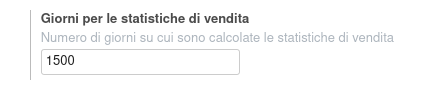
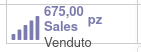
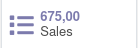

Nella configurazione vendite è stato aggiunto un campo in cui scegliere su quanti giorni precedenti alla data attuale vengono calcolate le statistiche dei prodotti venduti:

Smart button raggiungibile nel prodotto:

e se è installato il modulo `https://github.com/OCA/sale-workflow/tree/12.0/product_form_sale_link`:

