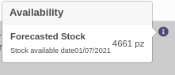
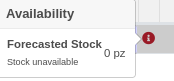
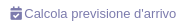
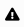
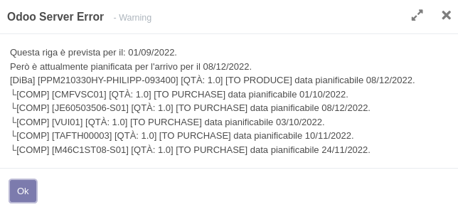

Sulla riga ordine di vendita è presente un'icona (i) quando:
 #. l'ordine non ha una data di impegno;
 #. la riga non ha una data di impegno.

L'icona è in blu quando il sistema trova una disponibilità futura a stock del prodotto. È in rosso in caso contrario.

Quando l'icona è in blu mostra la quantità disponibile per coprire la richiesta alla prima data possibile, senza che questo prelievo incida sullo stock in modo da farlo diventare negativo.

Es. con una richiesta di 1 pz con un ordine alla data odierna del 01/07/2021 la disponibilità è immediata:

in quanto l'articolo è disponibile e lo stock previsto finale è superiore alla quantità richiesta. Con una richiesta di 4.662 pz la disponibilità è per il:

.. image:: ../static/description/richiesta_quantita_maggiore.png
    :alt: Richiesta quantità maggiore

in quanto l'articolo ha una quantità sufficiente a partire da quella data, e la quantità prevista finale è superiore a quella richiesta.

Quando l'icona è rossa segnala che non è possibile fornire da stock il prodotto:

Sull'ordine di vendita è stato aggiunto un bottone per calcolare la prima consegna possibile per tutte le righe dell'ordine:

N.B.: la data di consegna include la somma dei tempi di produzione indicati nei prodotti ed eventuali semilavorati, per cui è 'cautelativa' (l'utente può prevedere una data di impegno inferiore alla data disponibile, in caso di necessità ed essendo a conoscenza della possibilità di farlo).

Nelle righe, in caso la data di impegno sia precedente la prima data disponibilità per la riga, è visibile un'icona di segnalazione:

che apre un messaggio esplicativo dei dettagli dei componenti mancanti:

