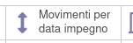
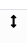
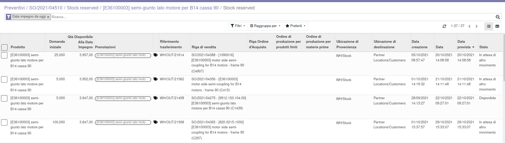
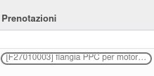

È disponibile una vista dei movimenti di magazzino relativi al prodotto con dettagli, accessibile dal prodotto:

o dalla riga dell'ordine di vendita

Questa vista contiene dettagli sulla quantità prevista per la data impegno e permette l'accesso agli oggetti da cui è originato il movimento (SO, PO, MO come prodotto finito e come componente):

Le prenotazioni (riserve) presenti sono visualizzate in questa colonna:

È inoltre possibile togliere la riserva su un prodotto con un tasto che apre una procedura guidata (accessibile anche dai trasferimenti):

.. image:: ../static/description/modifica_prenotazione.png.png
    :alt: Modifica prenotazione
