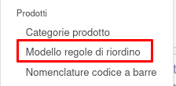
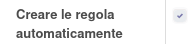
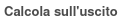
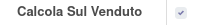
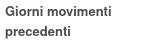
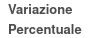
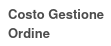
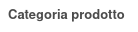

Nella configurazione di magazzino è presente un nuovo menu per creare e gestire i modelli di generazione delle regole di riordino:

Creando un nuovo modello ci sono alcuni campi che è possibile compilare per gestire la creazione automatica delle regole di riordino:

Il bottone `Genera regole automatiche`: se cliccato, disattiva le regole di riordino presenti e collegate al modello attuale e le ricrea, si può automatizzare con il campo indicato sotto.

Il campo `Crea le regole automaticamente`: se selezionato si evita di dover cliccare sul tasto `Genera regole automatiche` in alto. Attiva un cron che disattiva e ricrea le regole di riordino ad ogni esecuzione, rendendole quindi sempre allineate con la situazione attuale dello stock.

Il campo `Calcola sull'uscito`: se selezionato, basa il calcolo su cui valutare la richiesta del prodotto sulle uscite di qualsiasi genere, quindi per vendite e consumi di produzione in genere. Selezionandolo spariscono i campi per l'impostazione di valori fissi sulle regole di riordino, l'auto minimo e massimo e altri criteri inutili con questa opzione.

Il campo `Calcola sul venduto`: se selezionato, basa invece il calcolo sulle sole uscite per vendita. Se selezionato, prevale sul campo `Calcola sull'uscito` in quanto ne è un sottoinsieme. Selezionandolo spariscono i campi per l'impostazione di valori fissi sulle regole di riordino, l'auto minimo e massimo e altri criteri inutili con questa opzione.

Il campo `Giorni movimenti precedenti`: indica quanti giorni precedenti alla data attuale su cui andare a ricercare i movimenti di magazzino.

Il campo `Variazione percentuale`: impostando un valore tra -100 e 100, va a variare il valore della quantità di uscite calcolata in proporzione, usandolo nella formula di calcolo della scorta:

Il campo `Livello di servizio`: viene usato nella formula di calcolo della scorta:

Il campo `Costo gestione ordine`: anch'esso usato nella formula di calcolo della scorta:

Il campo `Categoria prodotti`: filtra i prodotti su cui generare le regole di riordino. In questo modo è possibile creare diversi modelli per diverse categorie di prodotti. Nota: i prodotti vengono letti dalle categorie prodotti indicate senza tenere conto delle categorie figlie.

Informazioni sulle formule usate nel file di calcolo https://github.com/efatto/efatto/blob/14.0/stock_orderpoint_generator_sale/static/description/calculate-safety-stocks.ods
