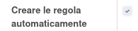

Nella configurazione di magazzino è presente un nuovo menu per creare e gestire i modelli di generazione delle regole di riordino:

Premendo su crea si apre la maschera in cui è possibile creare il modello, di cui ci sono alcuni campi extra rispetto alle regole di riordino generate:

Il campo `Genera automaticamente` che sfrutta un cron con il quale le regole di riordino vengono create/aggiornate/eliminate ad ogni esecuzione, rendendole quindi sempre allineate con la situazione attuale dello stock. Nota: le regole di riordino vengono rigenerate disattivando quelle precedenti.

Il campo `Calcola sul venduto` che basa il calcolo del magazzino sulle vendite:

Il campo `Giorni movimenti precedenti` che viene usato come periodo su cui ricercare i movimenti di vendita nel caso in cui non siano indicati la data di inizio e di fine del periodo:

Il campo `Variazione percentuale`, che va a variare il valore delle vendite calcolato, che viene usato nella formula di calcolo della scorta:

Il campo `Livello di servizio` che viene usato nella formula di calcolo della scorta:

Il campo `Costo gestione ordine` che viene usato nella formula di calcolo della scorta:

.. image:: ../static/description/costo_gestione_ordini.png
    :alt: Costo gestione ordine

Il campo `Categoria prodotti` che filtra i prodotti su cui generare le regole di riordino. In questo modo è possibile creare diversi modelli per diverse categorie di prodotti. Nota: i prodotti vengono letti dalle categorie prodotti indicate senza tenere conto delle categorie figlie.

Informazioni sulle formule usate nel file di calcolo allegato.
