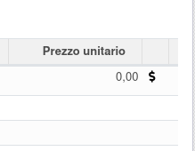
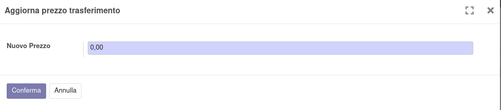

Nella riga del trasferimento è visibile il prezzo e un'icona del dollaro da cui si apre un wizard per la modifica del prezzo:

Questo è il wizard in cui indicare il nuovo prezzo (che sarà sempre impostato in negativo per i trasferimenti verso clienti):

La visibilità è limitata agli utenti con questo permesso (o superiore):

