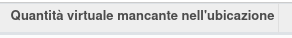

Nelle regole di riordino sono stati aggiunti dei campi:

un campo che visualizza le quantità attualmente in ordini di acquisto in stato bozza od inviato:

.. image:: ../static/description/rdp_acquisto.png
    :alt: Acquisti in bozza

e un campo disponibilità virtuale, che somma alla quantità virtuale quella del campo precedente, mostrandola solo nel caso sia negativa:

.. image:: ../static/description/totale_con_rdp_acquisto.png
    :alt: Disponibilità virtuale con acquisti in bozza

È stato aggiunto inoltre un campo ricercabile che permette di filtrare le regole di riordino la cui quantità virtuale prevista è negativa (può capitare nel caso in cui gli ordini di acquisto o le produzioni non siano state ancora processate in quanto i tempi di riapprovvigionamento sono inferiori al tempo mancante all'utilizzo delle merci):

che è possibile vedere (a scelta) nella vista elenco:

