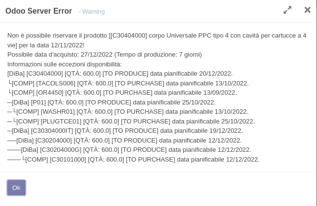

Nell'ordine di vendita è stata aggiunta un'opzione, attivata di default ma che l'utente può disabilitare, che blocca la vendita con date di impegno non possibili:

Le date di impegno non possibili sono definite come:

#. l'acquisto del prodotto (o dei suoi componenti) per la data richiesta non è possibile, in quanto i tempi di consegna sono più lunghi
#. la quantità disponibile nelle date degli scarichi di magazzino già prenotati sono inferiori alla quantità richiesta

In caso il campo sia abilitato e l'impegno nella data richiesta non sia possibile, verrà mostrato un messaggio di errore, in cui sono indicati il prodotto o i suoi componenti, la data di possibile acquisto, le date di disponibilità non conformi:

Che può essere risolto spostando la data di impegno, oppure disabilitando il controllo.

N.B.: L'errore viene esposto per un singolo prodotto/componente, cambiando la data con una in cui tale prodotto è acquistabile o in magazzino, potrebbe essere esposto un errore per un altro prodotto/componente e così via a scalare. Per calcolare la prima data utile complessiva, è disponibile il bottone seguente (se installato il modulo https://github.com/sergiocorato/efatto/tree/12.0/sale_stock_mrp_produce_delay ):

.. image:: ../static/description/calcola.png
    :alt: Calcola
