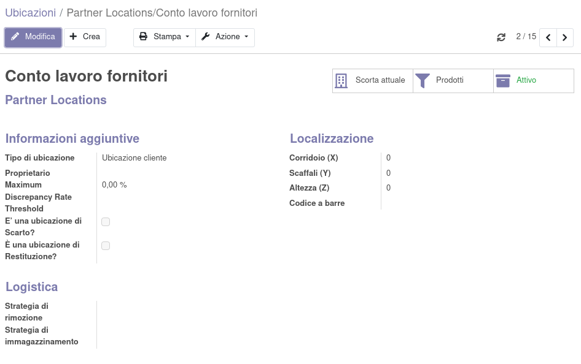
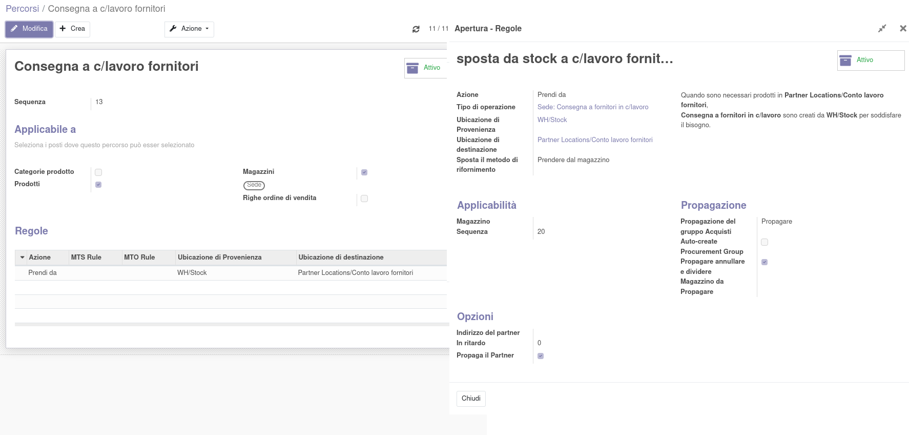
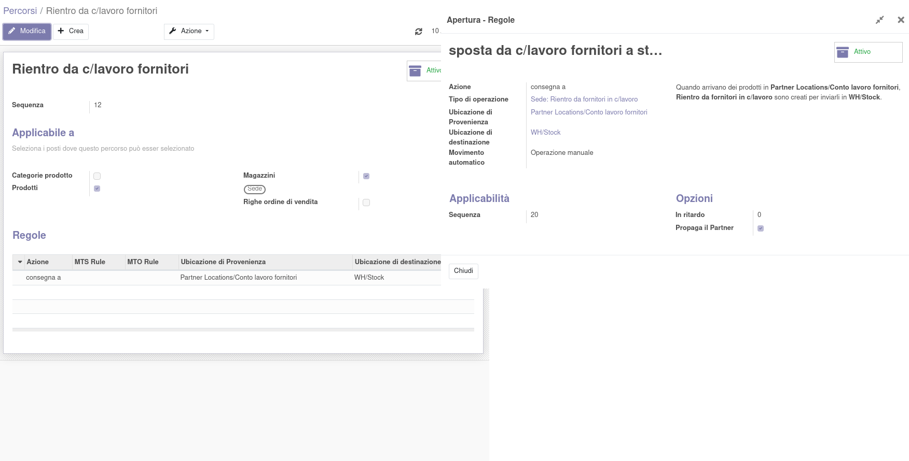
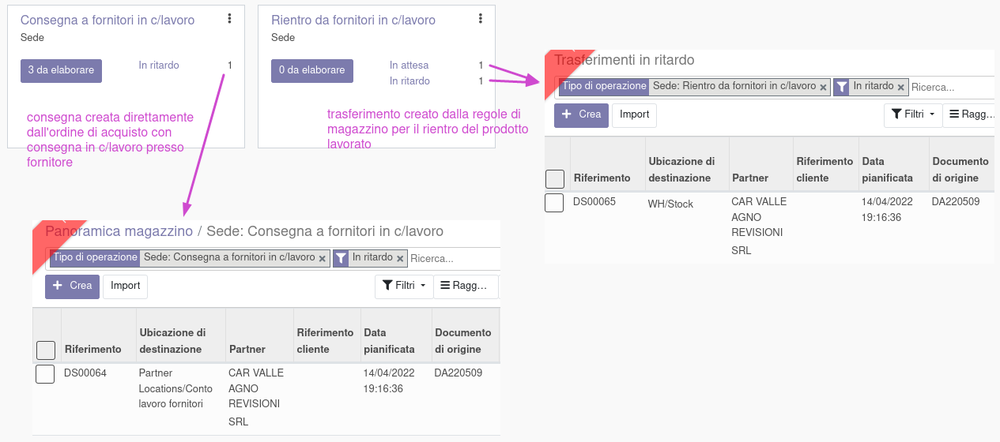
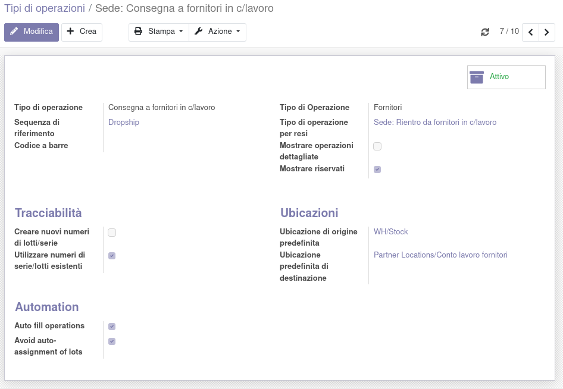
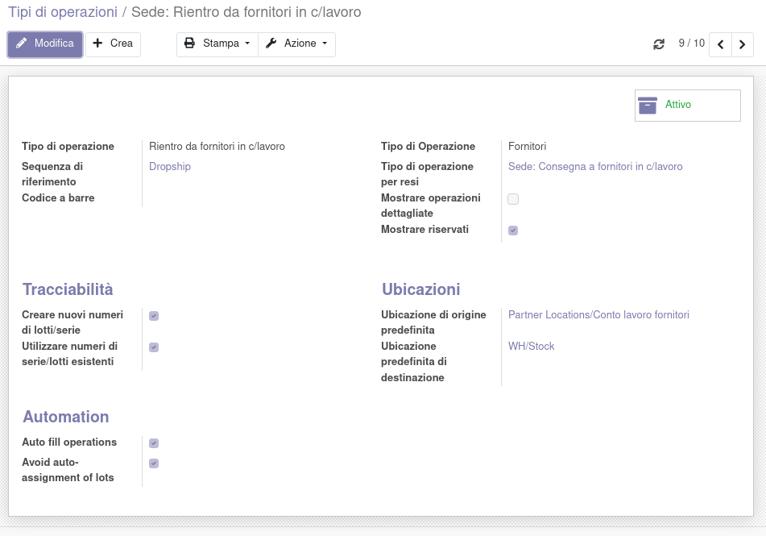

Nella configurazione delle regole nei percorsi del magazzino è stato aggiunto il campo `Propaga partner`:

Selezionandolo, è possibile fare in modo che il partner nel dropshipping venga propagato al trasferimento in rientro con questa configurazione:

